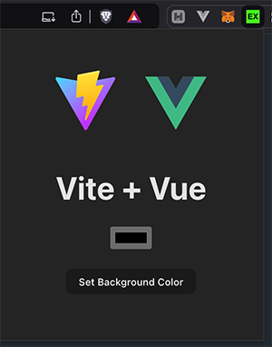
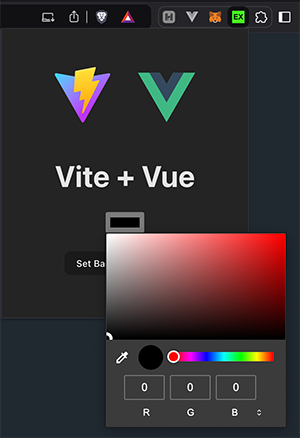

# ExtendoMatic

A simple Chrome Extension starter project that uses Vue 3 + TypeScript + Vite + Bun

## Development

Install dependencies:

`bun install`

To start the development server:

`bun run dev`

To build the extension:

`bun run build`

## Loading the Extension
1. Build the project using `bun run build`
2. Open your Chrome-compatible browser (Chrome, Edge, Brave, etc.)
3. Navigate to the extensions page:
    - Chrome: `chrome://extensions`
    - Edge: `edge://extensions`
    - Brave: `brave://extensions`
4. Enable "Developer mode" in the top-right corner
5. Click "Load unpacked" and select the `dist` directory from your project
6. The extension should now appear in your browser toolbar

**Note:** After making changes, run `bun run build` again and click the refresh icon on the extension card in your browser's extension page.

## Dependencies
- sharp ^0.33.5
- vue ^3.5.13

## Dev Dependencies
- @vitejs/plugin-vue ^5.2.1
- typescript ~5.6.2
- vite ^6.0.1
- vue-tsc ^2.1.10

## Great Success
If everything has been a success, you should see this after pinning the new extension:

### Most Excellent
you can now set a custom background color

