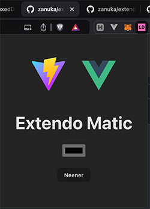
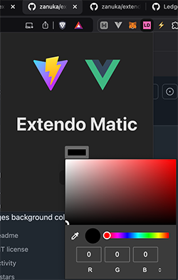

# ExtendoMatic

A simple Chrome Extension starter project that uses Vue 3 + TypeScript + Vite + Bun

## Prerequistes

### Installing Bun

Bun is a fast all-in-one JavaScript runtime like Node.js, but with a focus on performance and developer experience. To install Bun, you can use the following command:

```bash
curl -fsSL https://bun.sh/install | bash
```

This command will download and install Bun on your system. Make sure to follow any additional instructions provided by the installer to add Bun to your system's PATH.

### Why Use Bun?

- **Performance**: Bun is designed to be fast, with a focus on speed for both startup and runtime performance.
- **Built-in Tools**: Bun includes a bundler, transpiler, and package manager, reducing the need for additional tools.
- **Compatibility**: Bun aims to be compatible with Node.js, making it easier to transition existing projects.
- **Developer Experience**: With features like hot module reloading and a fast development server, Bun enhances the development workflow.


## Development

Install dependencies:

`bun install`

To start the development server:

`bun run dev`

To build the extension:

`bun run build`

## Icon Generation

To generate icons for the extension, run the following command:

`bun scripts/generate-icons.js`

This will generate the following icons in the `public/assets` directory:
- `icon-16.png`
- `icon-24.png`
- `icon-32.png`
- `icon-48.png`
- `icon-128.png`

## Loading the Extension
1. Build the project using `bun run build`
2. Open your Chrome-compatible browser (Chrome, Edge, Brave, etc.)
3. Navigate to the extensions page:
    - Chrome: `chrome://extensions`
    - Edge: `edge://extensions`
    - Brave: `brave://extensions`
4. Enable "Developer mode" in the top-right corner
5. Click "Load unpacked" and select the `dist` directory from your project
6. After pinning it, the extension should now appear in your browser toolbar

**Note:** After making changes, run `bun run build` again and click the refresh icon on the extension card in your browser's extension page.

## Dependencies
- sharp ^0.33.5
- vue ^3.5.13

## Dev Dependencies
- @vitejs/plugin-vue ^5.2.1
- typescript ~5.6.2
- vite ^6.0.1
- vue-tsc ^2.1.10

## Great Success
You should see this after pinning the new extension:



## Most Excellent
You can now set a custom background color:


